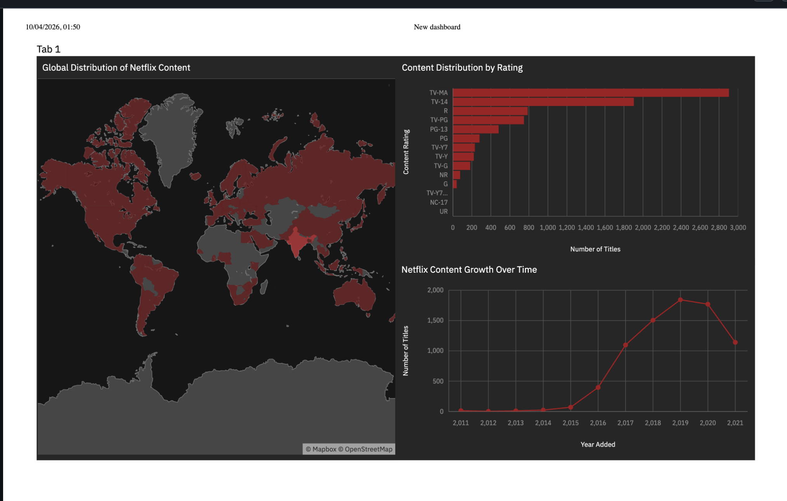
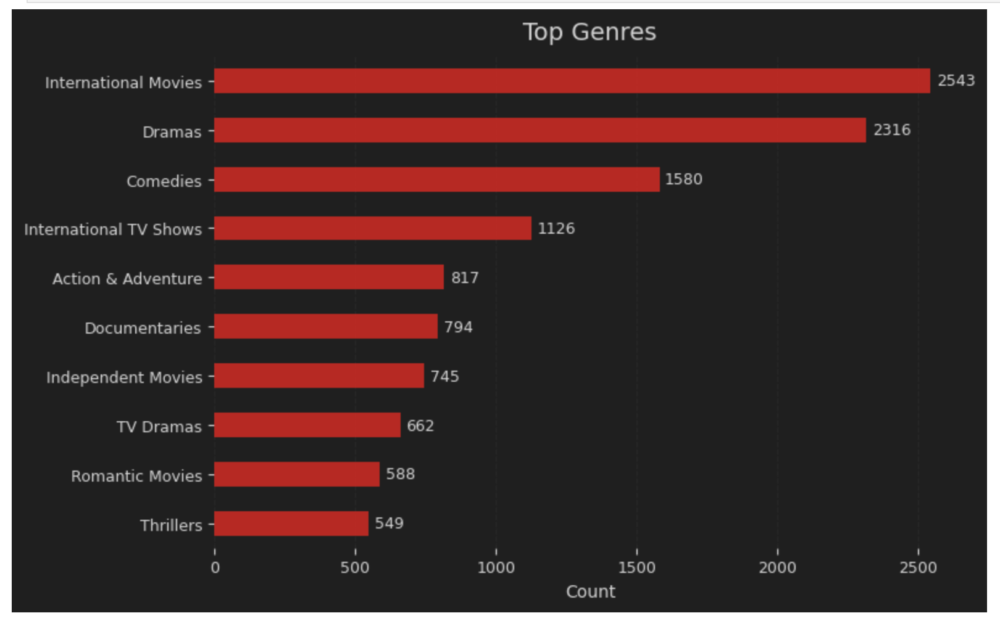
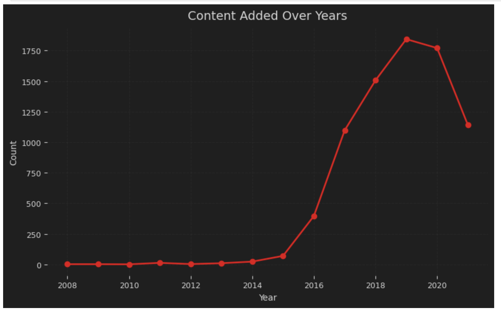
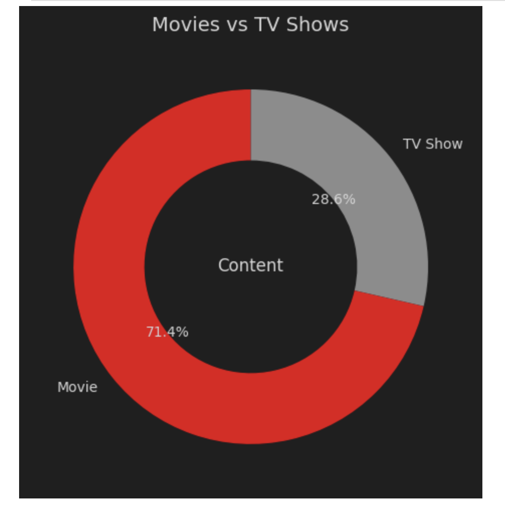
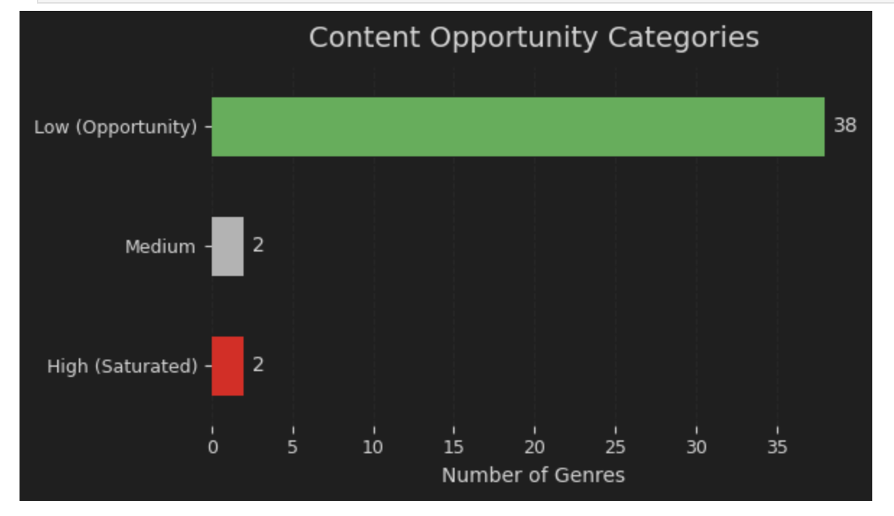

# Netflix Content Analysis

Netflix Content Analysis is a data analytics project focused on exploring Netflix movies and TV shows using Python, cleaned CSV data, dashboard visuals, and business insights.

The project analyzes content type, release trends, country distribution, ratings, genres, and platform-level content patterns to understand how Netflix's catalog is structured.

## Live Demo

Not deployed. This project is presented through a Jupyter Notebook, cleaned dataset, dashboard PDF, insight notes, and dashboard screenshots.

## Preview

### Dashboard Screens

| Content Overview | Type Distribution |
|---|---|
|  |  |

| Release Trends | Country Insights |
|---|---|
|  |  |

| Final Dashboard View |
|---|
|  |

## Project Highlights

- Analyzes Netflix movies and TV shows.
- Uses cleaned Netflix content data.
- Explores content type distribution between Movies and TV Shows.
- Analyzes release year trends and content growth.
- Studies country-wise content availability.
- Reviews ratings, genres, and platform catalog patterns.
- Includes a Jupyter Notebook for Python-based analysis.
- Includes a dashboard PDF for visual reporting.
- Includes an insights markdown file for business observations.
- Suitable for Data Analyst and Business Intelligence fresher portfolios.

## Tech Stack

- Python
- Pandas
- Matplotlib
- Seaborn
- Jupyter Notebook
- CSV
- Data Cleaning
- Data Analysis
- Data Visualization
- Dashboard Reporting
- PDF Dashboard

## Dataset

The included cleaned dataset is:

```text
netflix_cleaned (1).csv
```

The dataset contains Netflix catalog information such as content type, title, country, release year, rating, duration, genre/listed category, and related metadata.

## Main Files

```text
netflix.ipynb                Jupyter Notebook with analysis workflow
netflix_cleaned (1).csv      Cleaned Netflix dataset
netflix_dashboard.pdf        Dashboard report/export
Insights.md                  Key insights and observations
README.md                    Project documentation
s1.png                       Dashboard screenshot
s2.png                       Dashboard screenshot
s3.png                       Dashboard screenshot
s4.png                       Dashboard screenshot
s6.png                       Dashboard screenshot
```

## Analysis Approach

The project follows a standard data analytics workflow:

1. Load the cleaned Netflix dataset
2. Review dataset structure and columns
3. Handle missing or inconsistent values
4. Analyze Movies vs TV Shows distribution
5. Explore release year and content growth trends
6. Analyze country-wise content contribution
7. Study ratings, genres, and duration patterns
8. Create dashboard visuals
9. Summarize key insights for business interpretation

## Main Features

### Netflix Catalog Analysis

The project studies the Netflix content library and identifies trends in movies, TV shows, ratings, countries, and release years.

### Content Type Breakdown

The analysis compares the distribution of Movies and TV Shows to understand the platform's content mix.

### Release Trend Analysis

The project explores how Netflix content has grown over time and highlights release-year patterns.

### Country and Genre Insights

The analysis identifies major content-producing countries and commonly occurring categories/genres.

### Dashboard Reporting

The repository includes `netflix_dashboard.pdf` and screenshot previews to make the analysis easy to review.

### Insights Summary

The `Insights.md` file contains key findings and observations from the analysis.

## Project Structure

```text
Netflix_content_analysis/
├── Insights.md
├── README.md
├── netflix.ipynb
├── netflix_cleaned (1).csv
├── netflix_dashboard.pdf
├── s1.png
├── s2.png
├── s3.png
├── s4.png
└── s6.png
```

## Setup

Clone the repository:

```bash
git clone https://github.com/Sagnik0910/Netflix_content_analysis.git
cd Netflix_content_analysis
```

Install required Python libraries:

```bash
pip install pandas matplotlib seaborn jupyter
```

Open the notebook:

```bash
jupyter notebook netflix.ipynb
```

## How To View The Dashboard

Open the dashboard PDF:

```text
netflix_dashboard.pdf
```

Or view the dashboard screenshots directly in the repository:

```text
s1.png
s2.png
s3.png
s4.png
s6.png
```

## Example Use Cases

- Netflix catalog analysis
- Movies vs TV Shows comparison
- Content release trend analysis
- Country-wise content analysis
- Genre and rating analysis
- Data analyst portfolio project
- Business intelligence dashboard practice
- Exploratory data analysis practice

## Current Limitations

- The project is not deployed as an interactive dashboard.
- Dashboard interactivity is limited because the final output is exported as PDF/images.
- The analysis depends on the available cleaned dataset.
- More detailed statistical analysis can be added in future versions.
- SQL-based analysis can be added for stronger analyst portfolio value.

## Future Improvements

- Add interactive dashboard using Power BI, Tableau, Streamlit, or Plotly Dash.
- Add SQL queries for Netflix catalog analysis.
- Add more detailed business recommendations.
- Include additional screenshots from the notebook.
- Add charts directly inside the README.
- Add an executive summary section.
- Deploy an interactive version publicly.

## Author

Sagnik Guha

GitHub: [Sagnik0910](https://github.com/Sagnik0910)
